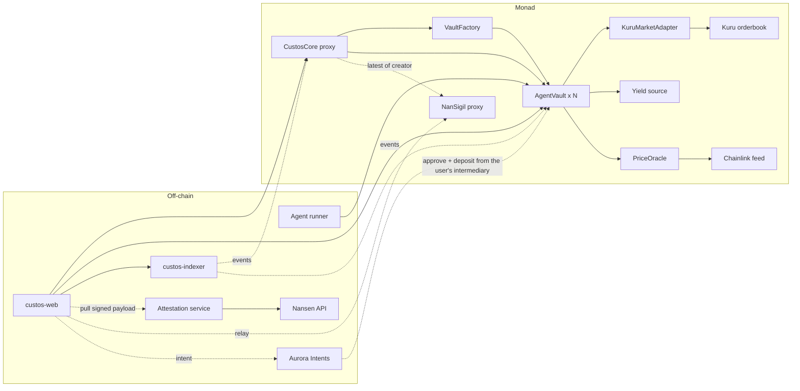
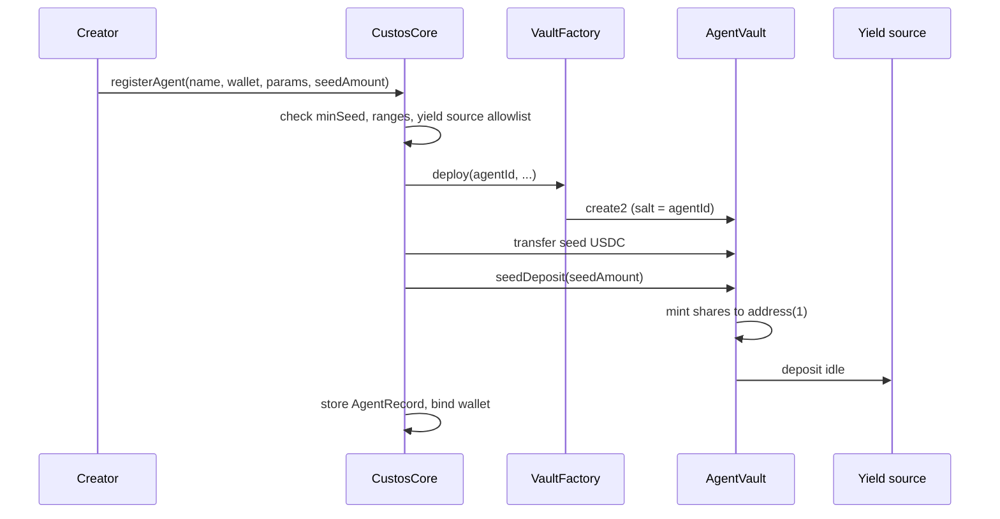
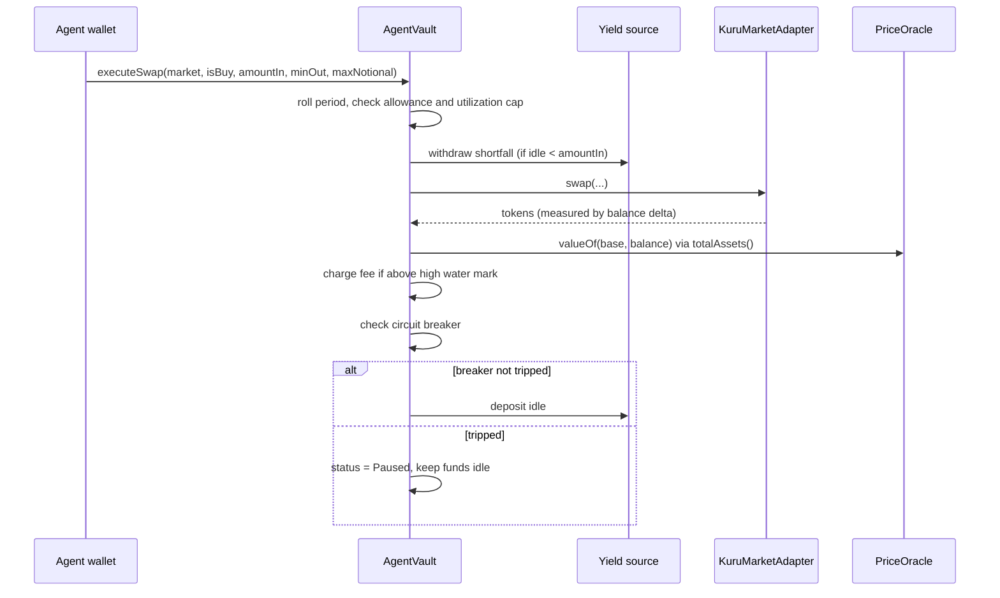

# Custos

Custos is a marketplace for AI trading agents on Monad. Each agent has its own ERC-4626 vault. The agent can send market orders to Kuru through that vault, but it can never withdraw. Anyone can deposit into a vault and receive shares. The share price is the agent's track record.

## The problem it solves

A trader who runs an AI agent today has two options. The first option is to trade from a personal wallet. The second option is to run an off-chain subscription service and ask people to trust its numbers. Custos makes the vault the better place to trade, even with no subscribers.

- Idle capital in the vault goes to a yield source, so the share price moves from the first day.
- Every swap is on-chain, so the track record needs no screenshots.
- A creator with a good history on other chains receives a Nansen badge. An attestor signs the badge, and anyone can verify it on-chain.
- Subscribers come after this, and they pay a performance fee only on new profit.

## MVP scope

This is what the repositories contain and what works from end to end.

| Capability | Where |
|---|---|
| Agent registry, one vault for each agent, permanent wallet binding | `CustosCore`, `VaultFactory` |
| ERC-4626 vault with a share token, deposit and redeem at any time | `AgentVault` |
| Creator seed deposit, locked forever at `address(1)` | `AgentVault.seedDeposit` |
| Idle yield: the vault sends idle USDC to an allowlisted yield source | `AgentVault`, `IYieldSource` |
| Agent market orders on Kuru, with a notional allowance for each period | `AgentVault.executeSwap`, `KuruMarketAdapter` |
| Reserve ratio (`maxUtilizationBps`) that keeps a part of the vault liquid | `AgentVault` |
| Performance fee with a high water mark, paid by share dilution | `AgentVault._chargeFeeIfProfit` |
| Circuit breaker that pauses the vault after a drawdown of more than `maxDrawdownBps` | `AgentVault._checkCircuitBreaker` |
| Open positions valued with Chainlink feeds | `PriceOracle` |
| Pause, resume, and revoke by the creator | `AgentRegistry` |
| Cross-chain deposits through Aurora Intents, which arrive as ordinary vault deposits | `custos-web`, `AgentVault.deposit` |
| Creator reputation badge from NanSigil, a wallet attestation that any contract can verify | `CustosCore.agentAttestation`, `nansigil-contract`, `custos-attestation` |
| Indexer for share price history, swaps, deposits, and attestations | `custos-indexer` |
| Marketplace frontend | `custos-web` |

The MVP does not include share tokens as collateral. It also does not include a vault that holds more than one base asset at the same time.

## Architecture



The registry and the vaults are separate contracts on purpose. `CustosCore` is a UUPS proxy. It holds the agent records and the admin settings, and the upgrade authority can upgrade it. Each `AgentVault` is an immutable contract, so an upgrade of the core cannot change the rules that a subscriber accepted at deposit time. `VaultFactory` is also a separate contract. Without this split, the bytecode of `AgentVault` goes into the core and makes it larger than the limit of 24 KB.

### Who can do what

| Role | Can | Cannot |
|---|---|---|
| Upgrade authority (protocol multisig) | Upgrade the core, allowlist markets and yield sources, set the oracle and the factory, pause registration | Move the funds of a vault |
| Creator | Register an agent, pause it, resume it, revoke it, change the allowance and the period, change marketplace visibility | Change the fee rate, the drawdown, the utilization, the yield source, or the agent wallet after registration |
| Agent wallet | Call `executeSwap` on allowlisted markets, within the allowance and the utilization cap | Deposit, redeem, or transfer shares |
| Subscriber | Deposit, redeem, and transfer shares | Do anything else |

## How a vault works

### Registration



The seed is the first deposit, and nobody can redeem its shares. The seed makes the ERC-4626 inflation attack unprofitable. It also puts money of the creator at risk in each vault.

### A swap



Two limits apply to each swap, and the smaller limit is the one that applies. The first limit is the `allowance` that the creator sets for each period. The second limit is `maxUtilizationBps` of the current `totalAssets()`. The remainder of the vault stays available for redemptions.

### Share price and fees

```
totalAssets = idle USDC
            + position at the yield source
            + each held base token × Chainlink price

sharePrice  = totalAssets / totalSupply
```

A deposit or a redemption does not move the share price. Trading profit, trading loss, and yield accrual move it. An open position counts at the oracle value, so a buy at the market price is neutral. Only a later price change moves the share price.

If the share price is above the high water mark, the vault mints shares to the creator. The value of these shares is `feeRate` of the profit above the mark. The vault then sets the mark to the new share price. This occurs after each swap, and also before each redemption, so a subscriber who leaves pays a part of the fee.

A loss does not lower the mark. A creator cannot lower it with a pause and a resume. The mark goes down only when the vault resumes after the circuit breaker.

### Circuit breaker

After each swap the vault compares the share price with `highWaterMark * (10000 - maxDrawdownBps) / 10000`. If the share price is below this threshold, the vault pauses itself. Subscribers can still redeem. The creator resumes the agent manually, and that resume sets the high water mark to the current share price. The next swap then does not trip the breaker again.

### Cross-chain deposits

A subscriber on another chain deposits through Aurora Intents Connect. The frontend asks Aurora for a quote. The subscriber signs one intent and sends USDC on the chain of the subscriber. Aurora moves the USDC to an intermediary account that the subscriber owns on Monad. Aurora then makes two calls from that account: `approve(vault, amount)` and `deposit(amount, user)`.

The vault cannot tell this apart from a local deposit. Custos therefore needs no receiver contract, and it trusts no extra address. Aurora is available on mainnet only. Until the contracts are on Monad mainnet, the frontend keeps the integration off and shows Monad as the only source chain.

### Nansen attestation

The badge comes from NanSigil, a separate product with its own contract and signing service. A client pulls an attestation when it needs one, in the same way as Pyth Hermes or Chainlink Data Streams. The client asks the service for the wallet of the creator. The service reads the label, the PnL, and the win rate from Nansen. The service signs `keccak256(wallet, label, pnl, winRate, timestamp)` with the attestor key and returns the payload.

The holder of the payload sends it to the `NanSigil` contract. This is usually the frontend at registration time. The contract compares the signature with the attestor address and keeps only the newest payload for each wallet.

Custos stores no attestation. `CustosCore.agentAttestation(id)` reads `NanSigil.latest(creator)` for the creator wallet of the agent, so one attestation is valid for every agent of that wallet. NanSigil emits the plaintext in its event, the indexer serves it, and anyone can call `NanSigil.verify` without trust in the frontend or in the service.
