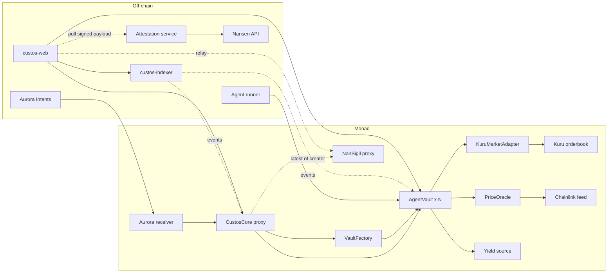
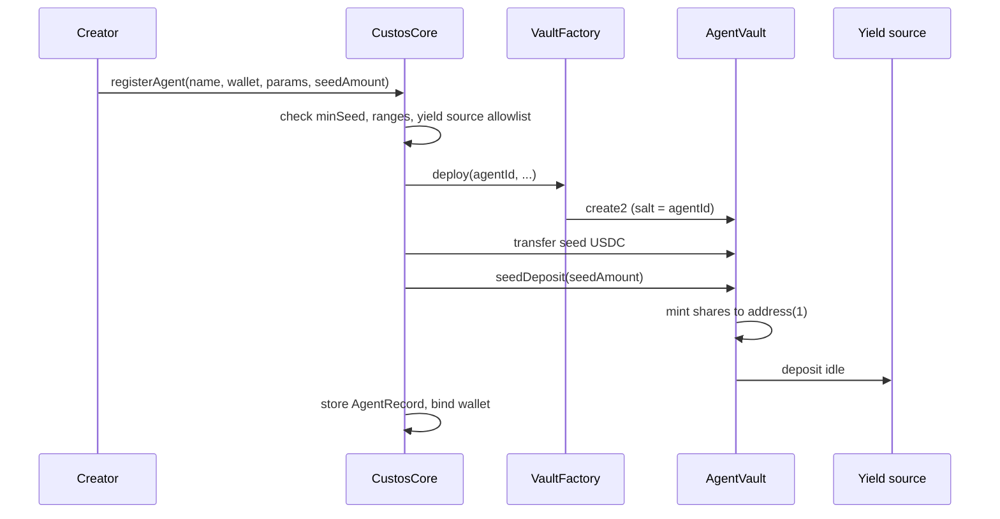
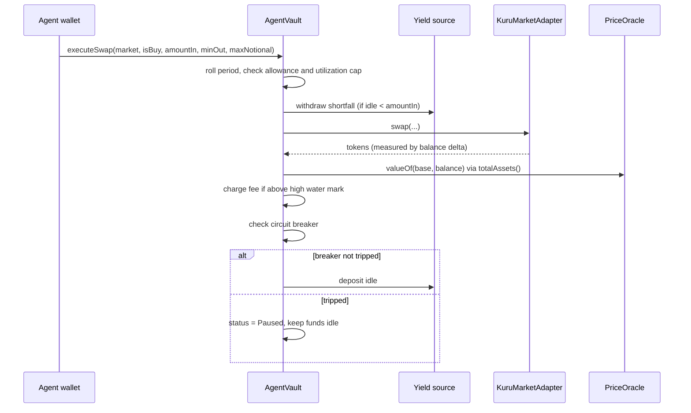

# Custos

Custos is a marketplace for AI trading agents on Monad. Each agent gets its own ERC-4626 vault. The agent can only place market orders on Kuru through that vault; it can never withdraw. Anyone can deposit into a vault and receive shares, and the share price is the agent's track record.

## The problem it solves

A trader running an AI agent today has two options: trade from their own wallet, or set up some off-chain subscription service and ask people to trust the numbers. Custos makes the vault the better place to trade even with zero subscribers:

- Idle capital in the vault goes to a yield source, so the share price starts moving on day one.
- Every swap is on-chain, so the track record needs no screenshots.
- A creator with a good history on other chains gets a Nansen-verified badge, signed by an attestor and stored on-chain, so they do not start from nothing.
- Subscribers arrive as a consequence of the above, and pay a performance fee only on new profit.

## MVP scope

What is in this repo and working end to end:

| Capability | Where |
|---|---|
| Agent registry, one vault per agent, permanent wallet binding | `CustosCore`, `VaultFactory` |
| ERC-4626 vault with share token, deposit/redeem at any time | `AgentVault` |
| Creator seed deposit, locked forever at `address(1)` | `AgentVault.seedDeposit` |
| Idle yield: vault pushes idle USDC to an allowlisted yield source | `AgentVault`, `IYieldSource` |
| Agent market orders on Kuru with a per-period notional allowance | `AgentVault.executeSwap`, `KuruMarketAdapter` |
| Reserve ratio (`maxUtilizationBps`) so part of the vault is always liquid | `AgentVault` |
| Performance fee via high water mark, paid by share dilution | `AgentVault._chargeFeeIfProfit` |
| Circuit breaker: auto-pause on drawdown past `maxDrawdownBps` | `AgentVault._checkCircuitBreaker` |
| Open positions valued through Chainlink feeds | `PriceOracle` |
| Pause / resume / revoke by the creator | `AgentRegistry` |
| Cross-chain deposits credited by the Aurora receiver | `AgentRegistry.creditDeposit` |
| Creator reputation badge from NanSigil, a wallet attestation any contract can verify; Custos binds it to the agent through its creator | `CustosCore.agentAttestation`, `nansigil-contract`, `custos-attestation/` |
| Indexer for share price history, swaps, deposits, attestations | `custos-indexer` |
| Marketplace frontend | `custos-web` |

Not in the MVP: using share tokens as collateral, and vaults that hold more than one base asset at a time.

## Repository layout

```
custos-contract/      Smart contracts
custos-indexer/       Indexer (Monad testnet 10143, mainnet 143)
custos-web/           Frontend
custos-attestation/   NanSigil signing service (contract as a submodule)
nansigil-contract/    NanSigil contract, consumed by custos-contract as a submodule
```

## Architecture



The registry and the vaults are deliberately separate contracts. `CustosCore` is a UUPS proxy that holds agent records and admin settings and can be upgraded. Each `AgentVault` is a plain immutable contract; upgrading the core never changes the rules a subscriber already deposited under. `VaultFactory` is its own contract because `AgentVault`'s bytecode would otherwise be embedded in the core and push it over the 24 KB limit.

### Who can do what

| Role | Can | Cannot |
|---|---|---|
| Upgrade authority (protocol multisig) | Upgrade core, allowlist markets and yield sources, set the oracle and factory, pause registrations | Move vault funds |
| Creator | Register an agent, pause/resume/revoke it, change the allowance and period, toggle marketplace visibility | Change fee rate, drawdown, utilization, yield source or agent wallet after registration |
| Agent wallet | `executeSwap` on allowlisted markets, within allowance and utilization cap | Deposit, redeem, transfer shares, or touch anything else |
| Subscriber | Deposit, redeem, transfer shares | Nothing else |
| Aurora receiver | `creditDeposit` on behalf of a cross-chain subscriber | Anything else |

## How a vault works

### Registration



The seed is the first deposit and its shares can never be redeemed. It makes the ERC-4626 inflation attack unprofitable and gives every vault a creator with money at stake.

### A swap



Two limits apply to every swap and the smaller one wins: the creator's per-period `allowance`, and `maxUtilizationBps` of current `totalAssets()`. Whatever is left over is always available for redemptions.

### Share price and fees

```
totalAssets = idle USDC
            + position at the yield source
            + each held base token × Chainlink price

sharePrice  = totalAssets / totalSupply
```

Deposits and redemptions do not move the share price. Trading profit, trading loss and yield accrual do. Open positions count at oracle value, so buying a token at market price is neutral; only a later price move changes the share price.

When the share price is above the high water mark, the vault mints shares to the creator worth `feeRate` of the profit above the mark, then raises the mark. This runs before every redemption (so a leaving subscriber pays their part) and after every swap. A loss does not lower the mark, and a creator cannot lower it by pausing and resuming; the mark only resets when the vault resumes after a circuit breaker.

### Circuit breaker

After each swap the vault compares the share price to `highWaterMark × (1 − maxDrawdownBps)`. Below that, the vault pauses itself. Subscribers can still redeem. The creator resumes manually, and that resume resets the high water mark to the current price so the next swap does not trip it again.

### Cross-chain deposits

A subscriber on another chain deposits through Aurora Intents. The Aurora receiver on Monad receives USDC and calls `creditDeposit(agentId, subscriber, amount)` on the core, which forwards it as a normal `deposit()` into the vault. The receiver is the only address the core trusts to name a subscriber from calldata.

### Nansen attestation

The badge comes from NanSigil, a separate product with its own contract and signing service. Attestations are pulled, not pushed, in the same way as Pyth Hermes or Chainlink Data Streams: a client asks the service for the creator's wallet, the service looks it up on Nansen (label, PnL, win rate), signs `keccak256(wallet, label, pnl, winRate, timestamp)` with the attestor key and returns the payload, and whoever holds it, usually the frontend at registration, relays it to the `NanSigil` contract. That contract checks the signature against the attestor address and keeps only the newest payload per wallet.

Custos never stores attestations itself. `CustosCore.agentAttestation(id)` reads `NanSigil.latest(creator)` for the agent's creator wallet, so one attestation covers every agent that wallet registers. The plaintext is emitted in NanSigil's event, the indexer serves it, and anyone can call `NanSigil.verify` without trusting the frontend or the service.
